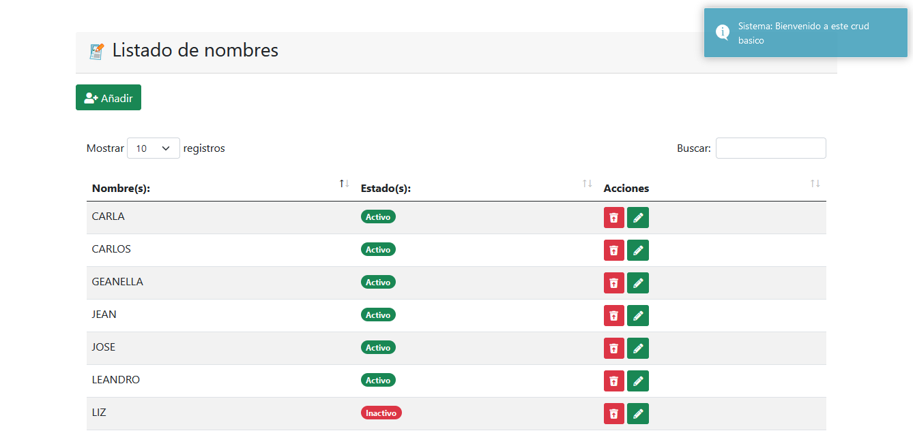

# CODEIGNITER 4

     

### Pasos para usar el proyecto en tu equipo.

#### Repositorio de GITHUB:
`$ https://github.com/harlericho/codeigniter_crudbasico_nombres.git`

# CarlChokSanc
 

# codeigniter_crudbasico_nombres

Crud basico de listado de nombres usando codeigniter 4:

    - dejo el script de la base de datos.
    - importar a cualquier gestor de base de datos sea mariadb o mysql.
# instalación en windows o mac:

 1. - tener cualquier servidor local sea xampp o laragon
 2. - clonar el repositorio en la carpeta root del servidor local.
 3. - configurar el archivo env:
     - cambiarle a .env
     - estando en el archivo .enc configurar la ruta del sistema:
     app.baseURL = 'http://localhost/sitiosweb/codeigniter_crudbasico_nombres' (por tu ruta especifica).

# instalación en linux:

1. - tener un servidor local si es LAMP.
2. - clonar el repositorio en la ruta var/www/html
3. - dar permiso de lectura a la carpeta writable:
    - sudo chmod -R 777 writable (permisos).
4. - configurar el archivo env:
     - cambiarle a .env
     - estando en el archivo .enc configurar la ruta del sistema:
     app.baseURL = 'http://localhost/sitiosweb/codeigniter_crudbasico_nombres' (por tu ruta especifica).